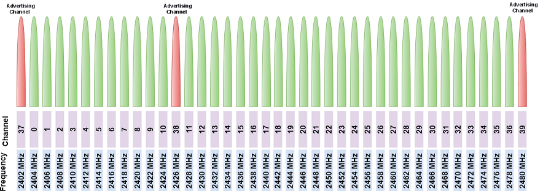
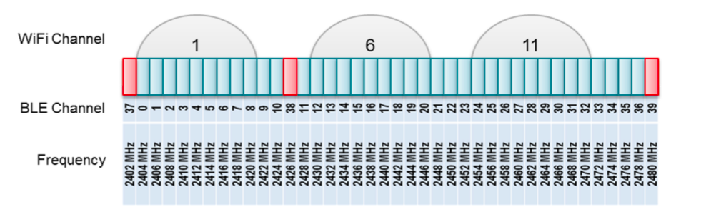

# Understanfing BTLE

This repository explores and tries to undestland BLE technology.


# Sub directories

```
    server, We create an UART that sends single letters when connected 
    client , Requres a display(M5) as we select what device to connect to with the buttons.

    [hackrf-sniff](hack-rf) sniff. Sniffer software code from https://github.com/JiaoXianjun/BTLE
The major limitation of using HackRFOne as sniffer that it does not handle channel jumping so well.
This is another sniffer, however bandwidth might be a problem. It tunes the HACKRF to 2427.0
https://github.com/mikeryan/ice9-bluetooth-sniffer This has nice integration with wireshark. <BR>

    i_beacon, Simple iBeacon  

    The hci controller software Is from the examples direcory.
    $(HOME)/.platformio/packages/framework-espidf/examples/bluetooth/hci/controller_vhci_ble_adv

    [vci_ble_simulate](simulation), This is taken from qemu to allow simulation of the BLE controller over a socket.
    [esp32-bluetooth-golden-binary] HCI over UART.
```


# Bluetooth LE Channels
The Bluetooth LE system operates in the 2.4 GHz ISM band at 2400 - 2483.5 MHz. It uses 40 RF channels (each channel is 2 MHz wide). Channel 37,38 and 39 are advertiser channels.




The Idea was to go down a rabbit hole similar to this.
https://github.com/lupyuen/lupyuen.github.io/blob/master/src/wifi.md
[Read the article "Reverse Engineering WiFi on RISC-V BL602"](https://lupyuen.github.io/articles/wifi)
There are some really useful pointers and information in this.




https://docs.platformio.org/en/latest/boards/espressif32/m5stack-core2.html


https://tinygo.org/docs/reference/microcontrollers/machine/m5stack-core2/


## ChatGPT conversation.
However, as we live in a new ai-age of I thought I ask chat GPT about this.
The AI is mostly hallucinating  https://en.wikipedia.org/wiki/Hallucination_(artificial_intelligence)
[AI questions](AI.md) There might be sparks of information there.


One useful tip I got from the AI
Add internal debug logging to the Bluetooth controller software.

# Set debug level
```
#include "esp_bt.h"
extern int g_bt_plf_log_level;


// Set the logging level to debug
g_bt_plf_log_level = ESP_LOG_DEBUG;

// Release the memory used by the Bluetooth controller with the logging level set
esp_bt_controller_mem_release(ESP_BT_MODE_CLASSIC_BT);
```

Logging enabled in the server program.


```
CO [29345], type 0, ts 29347, ap 0 0, cs 9, met 8
EE elt 0x3ffce2d8, ts 29352, 0
BT BB INTR enabled!
CO First, elt 0x3ffce2d8
CO [29421], type 0, ts 29423, ap 0 0, cs 9, met 8
EE elt 0x3ffce2d8, ts 29428, 0
BT BB INTR enabled!
CO First, elt 0x3ffce2d8
CO [29501], type 0, ts 29503, ap 0 0, cs 9, met 8
EE elt 0x3ffce2d8, ts 29508, 0
BT BB INTR enabled!
CO First, elt 0x3ffce2d8
CO [29577], type 0, ts 29579, ap 0 0, cs 9, met 8
EE elt 0x3ffce2d8, ts 29584, 0
BT BB INTR enabled!
CO First, elt 0x3ffce2d8
CO [29657], type 0, ts 29659, ap 0 0, cs 9, met 8
EE elt 0x3ffce2d8, ts 29664, 0
BT BB INTR enabled!
CO First, elt 0x3ffce2d8
CO [29731], type 0, ts 29733, ap 0 0, cs 9, met 8
EE elt 0x3ffce2d8, ts 29738, 0
BT BB INTR enabled!
CO First, elt 0x3ffce2d8
CO [29807], type 0, ts 29809, ap 0 0, cs 9, met 8
EE elt 0x3ffce2d8, ts 29814, 0
BT BB INTR enabled!
CO First, elt 0x3ffce2d8
CO [29875], type 0, ts 29877, ap 0 0, cs 9, met 8
EE elt 0x3ffce2d8, ts 29882, 0
BT BB INTR enabled!
CO First, elt 0x3ffce2d8
CO [29947], type 0, ts 29949, ap 0 0, cs 9, met 8
EE elt 0x3ffce2d8, ts 29954, 0
BT BB INTR enabled!
CO First, elt 0x3ffce2d8
CO [30019], type 0, ts 30021, ap 0 0, cs 9, met 8
EE elt 0x3ffce2d8, ts 30026, 0
BT BB INTR enabled!
CO First, elt 0x3ffce2d8
CO [30089], type 0, ts 30091, ap 0 0, cs 9, met 8
EE elt 0x3ffce2d8, ts 30096, 0
BT BB INTR enabled!
CO First, elt 0x3ffce2d8
CO [30153], type 0, ts 30155, ap 0 0, cs 9, met 8
EE elt 0x3ffce2d8, ts 30160, 0
BT BB INTR enabled!
CO First, elt 0x3ffce2d8
CO [30227], type 0, ts 30229, ap 0 0, cs 9, met 8
EE elt 0x3ffce2d8, ts 30234, 0
BT BB INTR enabled!
CO First, elt 0x3ffce2d8
CO [30303], type 0, ts 30305, ap 0 0, cs 9, met 8
EE elt 0x3ffce2d8, ts 30310, 0
BT BB INTR enabled!
CO First, elt 0x3ffce2d8
CO [30373], type 0, ts 30375, ap 0 0, cs 9, met 8
EE elt 0x3ffce2d8, ts 30380, 0
BT BB INTR enabled!
CO First, elt 0x3ffce2d8
CO [30451], type 0, ts 30453, ap 0 0, cs 9, met 8
EE elt 0x3ffce2d8, ts 30458, 0
BT BB INTR enabled!
CO First, elt 0x3ffce2d8
CO [30515], type 0, ts 30517, ap 0 0, cs 9, met 8
EE elt 0x3ffce2d8, ts 30522, 0
BT BB INTR enabled!
CO First, elt 0x3ffce2d8
CO [30589], type 0, ts 30591, ap 0 0, cs 9, met 8
EE elt 0x3ffce2d8, ts 30596, 0
BT BB INTR enabled!
CO First, elt 0x3ffce2d8
CO [30653], type 0, ts 30655, ap 0 0, cs 9, met 8
EE elt 0x3ffce2d8, ts 30660, 0
BT BB INTR enabled!
CO First, elt 0x3ffce2d8
CO [30721], type 0, ts 30723, ap 0 0, cs 9, met 8
EE elt 0x3ffce2d8, ts 30728, 0
BT BB INTR enabled!
```


# Separate run 
```
 *** Sent Value: 74 ***
BT BB INTR enabled!
CO First, elt 0x3ffcab3c
CO [74281], type 4, ts 74283, ap 74283 363, cs 0, met 42
EE elt 0x3ffcab3c, ts 74284, 0
BT BB INTR enabled!
CO First, elt 0x3ffcab3c
CO [74329], type 4, ts 74331, ap 74331 362, cs 0, met 42
EE elt 0x3ffcab3c, ts 74332, 0
BT BB INTR enabled!
CO First, elt 0x3ffcab3c
CO [74377], type 4, ts 74379, ap 74379 361, cs 0, met 42
EE elt 0x3ffcab3c, ts 74380, 0
BT BB INTR enabled!
CO First, elt 0x3ffcab3c
CO [74425], type 4, ts 74427, ap 74427 360, cs 0, met 42
EE elt 0x3ffcab3c, ts 74428, 0
BT BB INTR enabled!
CO First, elt 0x3ffcab3c
CO [74473], type 4, ts 74475, ap 74475 359, cs 0, met 42
EE elt 0x3ffcab3c, ts 74476, 0
BT BB INTR enabled!
CO First, elt 0x3ffcab3c
CO [74521], type 4, ts 74523, ap 74523 358, cs 0, met 42
EE elt 0x3ffcab3c, ts 74524, 0
```

## Gemini 3.0 
```
Breakdown of the Log Logic

BT BB INTR enabled!: The CPU has just cleared the interrupt in the BLEINTACK register (Offset 0x218). The Baseband (BB) is now armed and waiting for the next timed event defined in the Exchange Table.

CO [74281] (Control Object): This is the internal scheduler's "wake up" call. It indicates that at baseband tick 74281, the hardware started preparing the radio for the event.type 4: This identifies the event as a BLE Connection. This differs from type 0 (Advertising), confirming that your Serial Server has an active peer connected.ts 74283 (Target Timestamp): The exact 625µs tick when the radio was physically keyed to transmit. This value is compared against the BLEBASETIMECNT register (Offset 0x21C).

ap 74283 363 (Anchor Point):74283: The reference time for the start of this connection interval.363: This is the Connection Event Counter. Notice it decrements in each subsequent block (362, 361, 360). This is used by the hardware to synchronize the frequency hopping sequence. cs 0 (Control Structure 0): The hardware is reading its instructions from EM_CONTROL_STRUCT index 0 (Memory Address 0x3FFB00B8).met 42 (Master Expected Time): This is a timing offset in microseconds. It tells the radio how long to keep the receiver open to account for "clock drift" between the ESP32 and the connected smartphone/client.

EE elt 0x3ffcab3c, ts 74284 (End of Event):0x3ffcab3c: The RAM address of the software structure (em_desc_node) that the hardware just updated.74284: The timestamp when the radio event finished. The event lasted exactly 1 tick (74284 - 74283).Hardware/Memory Interaction 

Summary: When you sent the value 74, the following chain reaction occurred in the registers and memory:

Component       Action Taken
EM_TX_DATA_BUF    The software placed the byte 0x4A (74) into the buffer at 0x3FFB0B82.
EM_TX_DESC_BASE   The descriptor for cs 0 was updated with the length of the data and the txptr pointing to the '74'
BLEBASETIMECNT   The 27-bit counter hit 74283.
EM_FREQ_TABLE    The hardware looked at entry 363 (the event counter) to decide which frequency to hop to next.BLEINTSTATOnce the '74' was physically sent, Bit 3 (EVENTINTSTAT) was set, triggering the next BT BB INTR log entry.


Log Type	Inferred BLE Operation	Reason for Mapping
0	     Advertising (ADV)	Seen in your first log where the system was setting up a beacon. This type typically handles the transmission of non-connectable or scannable packets.
1	     Scanning (SCAN)	In RW-based stacks, Type 1 is usually reserved for Passive or Active scanning windows where the receiver is opened to look for other advertisers.
2	Initiating (INIT)	This is the state where the controller is actively trying to establish a connection after detecting a specific advertiser.
3	Connection (Slave/Peripheral)	Often used for a peripheral device that has just been connected and is waiting for its first "Anchor Point".
4	Connection (Master/Central or Active Data)	This is your Serial '74' log. It indicates an active, established connection where the Anchor Point (ap) is moving and the Connection Event Counter is decrementing/incrementing.
5	Test Mode (DTM)	Triggered by the BLERFTESTCNTL register (Offset 0x2E0) for regulatory testing (Continuous TX/RX).

Control objects, 

struct co_list_hdr {
    struct co_list_hdr *next; // [Offset 0x00] Pointer to the next Control Object element
};

struct co_list {
    struct co_list_hdr *first; // Pointer to the high-priority/next event
    struct co_list_hdr *last;  // Pointer to the last/future event
};


struct co_elt_tag {
    struct co_list_hdr hdr;     // [Offset 0x00] Link to next event in scheduler (elt 0x3ffce2d8)
    uint16_t type;              // [Offset 0x04] Event type (0=Adv, 4=Conn)
    uint16_t state;             // [Offset 0x06] Current software state of the object
    uint32_t timestamp;         // [Offset 0x08] Scheduled start time (the 'ts' in your log)
    
    // Anchor Point / Timing Info
    uint32_t anchor_point;      // [Offset 0x0C] The 'ap' reference time
    uint16_t evt_counter;       // [Offset 0x10] The connection event counter (363, 362...)
    uint16_t met;               // [Offset 0x12] Master Expected Time / Window size
    
    // Hardware Mapping
    uint8_t  cs_idx;            // [Offset 0x14] The slot index (0-15) used in EM
    uint8_t  prio;              // [Offset 0x15] Priority for the scheduler
    
    // Callback Info
    uint32_t callback_end_evt;  // [Offset 0x18] Pointer to function called at 'EE' (End of Event)
    void* env_ptr;           // [Offset 0x1C] Pointer to the BLE Environment (llc_env or llm_env)
};

```
## Chat gpt (4.0)
This output seems to be related to the Bluetooth subsystem, specifically the Bluetooth baseband (BT BB) and the Link Manager Protocol (LMP). It is likely generated by enabling debugging for Bluetooth components. Let's break down the log messages to understand their meaning.

CO [29345], type 0, ts 29347, ap 0 0, cs 9, met 8: This log message is related to a Connection event (CO) occurring at timestamp 29345. The event type is 0, and it has an associated timestamp (ts) of 29347. The access point (ap) values are 0 0, the channel selection (cs) is 9, and the metrics (met) value is 8.
EE elt 0x3ffce2d8, ts 29352, 0: This log message is related to an End Event (EE) with an associated element (elt) at memory address 0x3ffce2d8, timestamp 29352, and an additional value of 0.
BT BB INTR enabled!: This log message indicates that the Bluetooth Baseband (BT BB) Interrupt (INTR) is enabled.
CO First, elt 0x3ffce2d8: This log message shows that the first Connection event (CO First) is related to the element (elt) at memory address 0x3ffce2d8.
The rest of the log messages follow a similar pattern, indicating that there are recurring Connection events and End Events, with Bluetooth Baseband Interrupts being enabled.

Please note that this output is specific to the Bluetooth implementation on your system, and the logs may be different for different platforms or SDK versions. The general idea is that these log messages help you understand the events and actions taken by the Bluetooth subsystem during its operation, which can be helpful for debugging and optimization purposes.

## Chat gpt (3.5)
The output you provided appears to be debug messages generated by the Bluetooth Baseband (BB) layer in the ESP32 Bluetooth stack. Here's a brief explanation of the messages:

"CO [29345], type 0, ts 29347, ap 0 0, cs 9, met 8": This message is a debug message generated by the BB layer that provides information about a Bluetooth packet. The message includes the packet type (type 0), the timestamp (ts), the access address (ap), the channel selection algorithm (cs), and the modulation index (met).
"EE elt 0x3ffce2d8, ts 29352, 0": This message is also a debug message generated by the BB layer that provides information about a Bluetooth packet. The message includes the element (elt) that the packet is associated with, the timestamp (ts), and additional information (0).
"BT BB INTR enabled!": This message is a debug message generated by the BB layer that indicates that the Bluetooth BB interrupt has been enabled.
Overall, these messages provide information about the Bluetooth communication between devices, including details about the packets being exchanged and the status of the BB layer. The messages are typically used for debugging and troubleshooting purposes to identify issues with the Bluetooth communication.

## Open assistant
This log output indicates various elements related to the initial configuration and setup of your ESP32 device. To understand the log sequence:

"CO" stands for "Configuration Object." Whenever a new Configuration Object is created or modified in the memory of an ESP32 device, a CO entry appears in the log containing its type and timestamp (ts). These entries are usually grouped together with similar timestamps, forming log blocks, which correspond to individual firmware/device reboots. Each block has a distinctive first line labeled "First," followed by subsequent lines representing further changes to configuration objects.
Timestamp: ts: The number of clock cycles since the last system reset or bootup. This value helps track when significant events occurred during initialization or runtime operations.
"EE" represents "Event Engine." Event Engine entries indicate successful registration of event handlers for specific peripheral features or internal components. They include a timestamp and a brief description ("elt") identifying the registering entity responsible for the event handler (in this case, 0x3ffce2d8 refers to the default Event Engine instance).
Timestamp: ts: Similar to CO, indicating the time of the EE registration.
"BT BB INTR enabled!" confirms that Interrupt request inputs supporting Blueooth Baseband communication have been activated successfully. This statement doesn't contribute to understanding your particular issues, so we won't discuss it any further.
The repeated substring "CO <timestamp>, elt 0x<some hex>, ... BT BB INTR enabled!" hints at the creation of several Configuration Object instances throughout the initial phase of device startup. This process should not cause any trouble unless something went wrong during object generation or binding. Please review this section more carefully to verify if there were any errors reported along these lines.
Overall, nothing in this log snippet suggests severe problems requiring immediate attention; however, please analyze the entire set o


# Useful resources.

https://www.youtube.com/watch?v=q4CxE5P6RUE


https://github.com/espressif/esptool/blob/master/flasher_stub/ld/rom_32.ld


https://randomnerdtutorials.com/esp32-ble-server-client/


https://www.scribd.com/document/741218511/RSL10-Hardware-Reference


# Hallucinated code, 

```
#ifndef ESP32_BTDM_H
#define ESP32_BTDM_H

#include <stdint.h>

#define BTDM_BASE_ADDR 0x3FF71000
#define EM_BASE_ADDR   0x3FFB0000

/* --- RSL10 Exchange Memory Structures --- */

struct em_buf_tx_desc {
    uint16_t txptr;      // Pointer to the actual data buffer in EM
    uint16_t txheader;   // BLE Packet Header (Type, Length)
    uint16_t txdataptr;  // Data plane offset
    uint16_t txdle;      // Data Length Extension control
};

struct co_list_hdr {
    uint32_t next;       // Pointer to next element in list
};

struct em_desc_node {
    struct co_list_hdr hdr;
    uint16_t idx;
    uint16_t buffer_idx;
    uint16_t buffer_ptr;
    uint8_t  llid;
    uint8_t  length;
};

/**
 * @brief BTDM Register Layout (ESP32 + RSL10 mapping)
 */
typedef struct {
    /* --- BR/EDR (Classic) Section --- */
    volatile uint32_t BTCNTL;           // 0x000: BR/EDR control
    
    union {
        struct {
            uint32_t BUILD : 8;
            uint32_t UPG   : 8;
            uint32_t REL   : 8;
            uint32_t TYP   : 8;
        };
        volatile uint32_t val;
    } BTVERSION;                        // 0x004: BR/EDR version

    uint32_t _reserved0[1];
    volatile uint32_t BTINTCNTL;        // 0x00C
    volatile uint32_t BTINTSTAT;        // 0x010
    volatile uint32_t BTINTRAWSTAT;     // 0x014
    volatile uint32_t BTINTACK;         // 0x018

    uint32_t _reserved1[121];           // Offset to BLE block (0x200)

    /* --- BLE Section (RSL10 Core) --- */
    
    // BB_RWBBCNTL
    union {
        struct {
            uint32_t SYNCERR           : 3;
            uint32_t _res0             : 1;
            uint32_t RXWINSZDEF        : 4;
            uint32_t RWBLE_EN          : 1;  // RW-BLE Core Exchange Table pre-fetch
            uint32_t ADVERTFILT_EN     : 1;
            uint32_t _res1             : 6;
            uint32_t HOP_REMAP_DSB     : 1;
            uint32_t CRC_DSB           : 1;
            uint32_t WHIT_DSB          : 1;
            uint32_t CRYPT_DSB         : 1;
            uint32_t NESN_DSB          : 1;
            uint32_t SN_DSB            : 1;
            uint32_t MD_DSB            : 1;
            uint32_t _res2             : 1;
            uint32_t SCAN_ABORT        : 1;
            uint32_t ADVERT_ABORT      : 1;
            uint32_t RFTEST_ABORT      : 1;
            uint32_t _res3             : 1;
            uint32_t SWINT_REQ         : 1;
            uint32_t REG_SOFT_RST      : 1;
            uint32_t MASTER_TGSOFT_RST : 1;
            uint32_t MASTER_SOFT_RST   : 1;  // RW-BLE Master reset
        };
        volatile uint32_t val;
    } BLECNTL;                          // 0x200 (RW Offset 0x00)

    // BB_VERSION
    union {
        struct {
            uint32_t BUILD : 8;
            uint32_t UPG   : 8;
            uint32_t REL   : 8;
            uint32_t TYP   : 8;
        };
        volatile uint32_t val;
    } BLEVERSION;                       // 0x204 (RW Offset 0x04)

    // BB_RWBLEBCONF
    volatile uint32_t BLECONF;          // 0x208 (RW Offset 0x08)

    // BB_INTCNTL
    union {
        struct {
            uint32_t CSCNTINTMSK      : 1; // 625μs Base Time
            uint32_t RXINTMSK         : 1;
            uint32_t SLPINTMSK        : 1;
            uint32_t EVENTINTMSK      : 1; // End of Event (Adv/Scan/Conn)
            uint32_t CRYPTINTMSK      : 1;
            uint32_t ERRORINTMSK      : 1;
            uint32_t GROSSTGTIMINTMSK : 1;
            uint32_t FINETGTIMINTMSK  : 1;
            uint32_t EVENTAPFAINTMSK  : 1;
            uint32_t SWINTMSK         : 1;
            uint32_t _res             : 22;
        };
        volatile uint32_t val;
    } BLEINTCNTL;                       // 0x20C (RW Offset 0x0C)

    volatile uint32_t BLEINTSTAT;       // 0x210 (RW Offset 0x10)
    volatile uint32_t BLEINTRAWSTAT;    // 0x214 (RW Offset 0x14)
    volatile uint32_t BLEINTACK;        // 0x218 (RW Offset 0x18)

    // BB_BASETIMECNT
    union {
        struct {
            uint32_t BASETIMECNT : 27;
            uint32_t _res        : 4;
            uint32_t SAMP        : 1;
        };
        volatile uint32_t val;
    } BLEBASETIMECNT;                   // 0x21C (RW Offset 0x1C)

    // BB_FINETIMECNT
    union {
        struct {
            uint32_t FINECNT : 10;
            uint32_t _res    : 22;
        };
        volatile uint32_t val;
    } BLEFINETIMECNT;                   // 0x220 (RW Offset 0x20)

    volatile uint32_t BLEBDADDRL;       // 0x224 (RW Offset 0x24)

    // BB_BDADDRU
    union {
        struct {
            uint32_t BDADDRU  : 16;
            uint32_t PRIV_NPUB : 1;
            uint32_t _res     : 15;
        };
        volatile uint32_t val;
    } BLEBDADDRU;                       // 0x228 (RW Offset 0x28)

    // BB_ET_CURRENTRXDESCPTR
    union {
        struct {
            uint32_t CURRENTRXDESCPTR : 15;
            uint32_t _res             : 1;
            uint32_t ETPTR            : 15; // Pointer to Exchange Table in EM
            uint32_t _res2            : 1;
        };
        volatile uint32_t val;
    } BLECURRENTRXDESCPTR;              // 0x22C (RW Offset 0x2C)

    uint32_t _reserved2[8];

    volatile uint32_t BLEDIAGCNTL;      // 0x250 (BB_DIAGCNTL)
    volatile uint32_t BLEDIAGSTAT;      // 0x254
    
    uint32_t _reserved3[2];
    volatile uint32_t BLEERRORTYPESTAT; // 0x260

    uint32_t _reserved4[3];
    volatile uint32_t BLERADIOCNTL0;    // 0x270 (BB_RADIOCNTL0)
    volatile uint32_t BLERADIOCNTL1;    // 0x274 (BB_RADIOCNTL1)

    uint32_t _reserved5[2];
    volatile uint32_t BLERADIOPWRUPDN;  // 0x280 (BB_RADIOPWRUPDN)

    uint32_t _reserved6[3];
    // BB_ADVCHMAP
    union {
        struct {
            uint32_t CHAN37 : 1;
            uint32_t CHAN38 : 1;
            uint32_t CHAN39 : 1;
            uint32_t _res   : 29;
        };
        volatile uint32_t val;
    } BLEADVCHMAP;                      // 0x290 (RW Offset 0xB0 shifted)

    uint32_t _reserved7[3];
    volatile uint32_t BLEADVTIM;        // 0x2A0 (BB_ADVTIM)

    uint32_t _reserved8[3];
    volatile uint32_t BLEWLPUBADDRPTR;  // 0x2B0 (BB_WLPUBADDPTR)
    volatile uint32_t BLEWLPRIVADDRPTR; // 0x2B4
    volatile uint32_t BLEWLNBDEV;       // 0x2B8

    uint32_t _reserved9[1];
    // BB_AESCNTL
    union {
        struct {
            uint32_t AES_START : 1;
            uint32_t AES_MODE  : 1;
            uint32_t _res      : 30;
        };
        volatile uint32_t val;
    } BLEAESCNTL;                       // 0x2C0 (RW Offset 0xE0 shifted)

    volatile uint32_t BLEAESKEY[4];     // 0x2C4 - 0x2D0
    volatile uint32_t BLEAESPTR;        // 0x2D4 (BB_AESPTR)

    uint32_t _reserved10[2];
    // BB_RFTESTCNTL
    union {
        struct {
            uint32_t TXLENGTH    : 9;
            uint32_t _res0       : 2;
            uint32_t TXPKTCNTEN  : 1;
            uint32_t TXPLDSRC    : 1;
            uint32_t PRBSTYPE    : 1;
            uint32_t TXLENGTHSRC : 1;
            uint32_t INFINITETX  : 1;
            uint32_t _res1       : 11;
            uint32_t RXPKTCNTEN  : 1;
            uint32_t _res2       : 3;
            uint32_t INFINITERX  : 1;
        };
        volatile uint32_t val;
    } BLERFTESTCNTL;                    // 0x2E0 (RW Offset 0x100 shifted)

    volatile uint32_t BLERFTESTTXSTAT;  // 0x2E4
    volatile uint32_t BLERFTESTRXSTAT;  // 0x2E8

    uint32_t _reserved11[1];
    // BB_TIMGENCNTL
    union {
        struct {
            uint32_t PREFETCH_TIME      : 9;
            uint32_t _res0              : 7;
            uint32_t PREFETCHABORT_TIME : 10;
            uint32_t _res1              : 5;
            uint32_t APFM_EN            : 1;
        };
        volatile uint32_t val;
    } BLETIMGENCNTL;                    // 0x2F0 (RW Offset 0x110 shifted)

    uint32_t _reserved12[3];
    volatile uint32_t BLECOEXIFCNTL0;   // 0x300 (BB_COEXIFCNTL0)

    uint32_t _reserved13[7];
    volatile uint32_t BLERALPTR;        // 0x320 (BB_RALPTR)
    volatile uint32_t BLERALNBDEV;      // 0x324

} btdm_dev_t;

/* --- Peripheral and Memory Access --- */

#define BTDM_PTR ((btdm_dev_t *)(BTDM_BASE_ADDR))

// Exchange Memory Pointers
#define EM_EXCH_TABLE       ((uint16_t*)(EM_BASE_ADDR + 0x0000))
#define EM_FREQ_TABLE       ((uint16_t*)(EM_BASE_ADDR + 0x0040))
#define EM_CONTROL_STRUCT   ((uint8_t*)(EM_BASE_ADDR + 0x00B8))
#define EM_TX_DESC_BASE     ((struct em_buf_tx_desc*)(EM_BASE_ADDR + 0x05AC))
#define EM_RX_DESC_BASE     ((struct em_buf_tx_desc*)(EM_BASE_ADDR + 0x0934))
#define EM_TX_DATA_BUF      ((uint8_t*)(EM_BASE_ADDR + 0x0B82))

#endif // ESP32_BTDM_H

```
Periodic dump


```
#include <stdio.h>
#include <string.h>
#include "esp_attr.h"
#include "freertos/FreeRTOS.h"
#include "freertos/task.h"


// Define the size of our capture buffers
#define FREQ_TABLE_SIZE 80
#define DESC_COUNT      16
#define DESC_SIZE       (sizeof(struct em_buf_tx_desc))

// Local RAM buffers to hold the snapshot
uint8_t  local_freq_table[FREQ_TABLE_SIZE];
struct em_buf_tx_desc local_tx_descs[DESC_COUNT];
uint32_t captured_ts;

static portMUX_TYPE btdmMux = portMUX_INITIALIZER_UNLOCKED;

void btdm_snapshot_task(void *pvParameters) {
    while(1) {
        // --- START CRITICAL SECTION ---
        // Disables interrupts to prevent BB hardware/software from 
        // updating pointers during the copy.
        portENTER_CRITICAL(&btdmMux);
        
        // 1. Capture current hardware time
        captured_ts = BTDM_PTR->BLEBASETIMECNT.BASETIMECNT;
        
        // 2. Copy the Frequency Table (0x3FFB0040)
        memcpy(local_freq_table, (void*)0x3FFB0040, FREQ_TABLE_SIZE);
        
        // 3. Copy the Control Structure/Descriptors (0x3FFB05AC or 0x3FFB00B8)
        // We capture the descriptors to see the 'txptr' values
        memcpy(local_tx_descs, (void*)0x3FFB05AC, DESC_COUNT * DESC_SIZE);
        
        portEXIT_CRITICAL(&btdmMux);
        // --- END CRITICAL SECTION ---

        // Now we can dump the info safely via Serial without blocking interrupts
        printf("\n=== BTDM SNAPSHOT AT TS: %u ===\n", captured_ts);
        
        // Dump Frequency Table (Hopping Map)
        printf("Freq Table (Channels): ");
        for(int i = 0; i < 40; i++) {
            uint16_t entry = ((uint16_t*)local_freq_table)[i];
            printf("%d ", entry & 0x3F);
            if(i == 19) printf("\n                       ");
        }
        
        // Dump TX Descriptors to find your '74'
        printf("\n\nTX Descriptors:\n");
        for(int i = 0; i < 8; i++) { // Dumping first 8 slots
            printf("Slot[%d] -> txptr: 0x%04X, Header: 0x%04X\n", 
                    i, local_tx_descs[i].txptr, local_tx_descs[i].txheader);
            
            // If txptr is in the Data Buffer range, it might be our '74'
            if(local_tx_descs[i].txptr >= 0x0B82) {
                uint8_t *data_in_em = (uint8_t*)(0x3FFB0000 + local_tx_descs[i].txptr);
                printf("   [!] Data at ptr: %02X %02X %02X\n", 
                        data_in_em[0], data_in_em[1], data_in_em[2]);
            }
        }

        vTaskDelay(pdMS_TO_TICKS(5000)); // Snapshot every 5 seconds
    }
}

```


